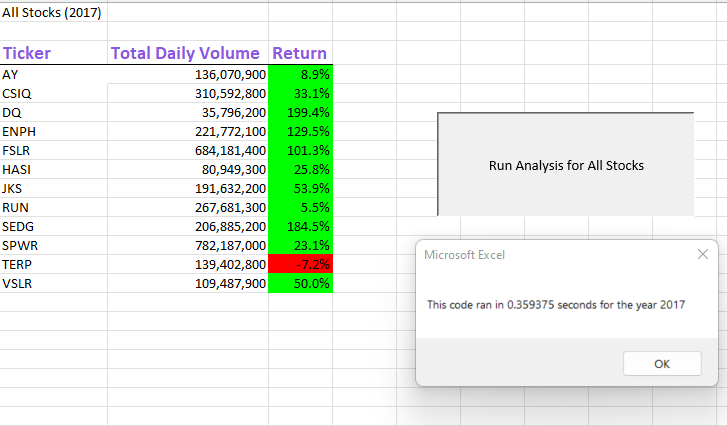
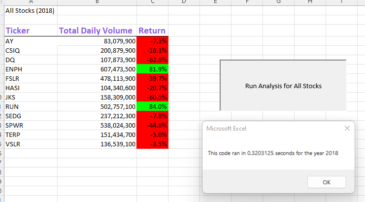
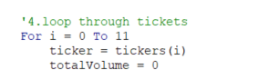
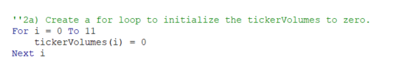

# "Green" Stock Analysis
In this datasheet we determined the return percentage of multiple "green" stocks from the years 2017 and 2018. Using this information we can then determine which stocks would be a smart investment choice.

## Results:
### 2017

### 2019

We are able to analyze the return percentage success between the years 2017 and 2018 by running the analysis for All Stocks. The analysis for 2017 precents mostly return percentages for most stocks. However, when we compare 2017 to the next year, 2018, we see that most stocks had a negative return to the next year. There were two stocks that had a postive return percentage in 2018, ENPH and RUN. ENPH had a 129.5% return in 2017 and a 81.9% return in 2018 while RUN had a 5.5% return in 2017 and a 84.0% return in 2018. While both these stocks has postive results in 2018, RUN saw the most percent growth from 2017 to 2018. 

### Original Script

### Refractored Script

When we run our analysis, our refractered code is about a full second faster than our original code. Refacorting our code took out extra steps that was causing our code to take extra time. Instead of looping through the data 12 times, we refractored the code to analyze the data as it went. This made our code more efficient. 

## Summary:
Advantages of refactoring code:
1. Cleaner and more comprehensive code
2. Can find errors within the code

Disadvantage of refactoring code: 
1. Could introduce possible bugs
2. Time consuming 

Refactoring the original script was a time consuming process. However, the pros of refactoring the original script outweight the cons. The refactored scrips is now much cleaners and more comprehensive. On the original, we had multiple subroutines. We now have a much more streamlined script that runs almost a full second faster than the original. 

